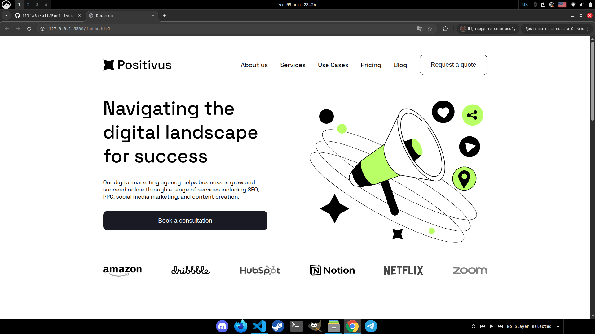
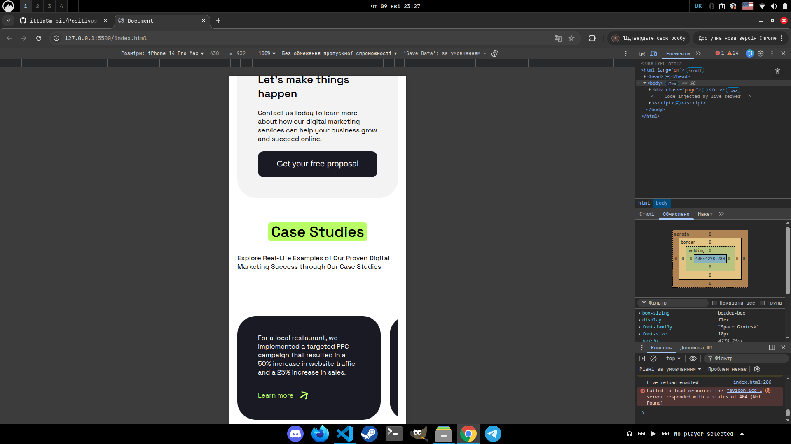

# 🚀 Posotivus Website




## 📝 Description

This project was created as part of my professional portfolio to showcase my frontend development skills as of **April 9, 2026**. It focuses on clean semantic HTML, modular SCSS architecture, and modern responsive design.

---

## 🛠 Tech Stack

| Technology     | Badge                                                                                                                        |
| :------------- | :--------------------------------------------------------------------------------------------------------------------------- |
| **HTML5**      |                     |
| **SCSS**       |                          |
| **JavaScript** |  |
| **Git**        |                           |

---

## 🚀 How to Run the Project

### 1. Download the Project

Clone the repository to your local machine:

```bash
git clone [https://github.com/illiaSm-bit/Positivus-Website.git](https://github.com/illiaSm-bit/Positivus-Website.git)
```

Alternatively, you can download the project as a ZIP file and extract it.

Alternatively, you can download the project as a ZIP file and extract it.

2. Open in Browser
   Navigate to the project folder and open the index.html file with any modern web browser (Chrome, Firefox, Edge, or Safari).

3. Enable Real-Time CSS Updates (Optional)
   This project uses Sass for styling. To modify the styles and have them compile automatically, ensure you have Sass installed and run:

```bash

sass --watch ./style/index.scss:style.css

```

4. Local Development Server
   For the best experience, including hot reloads, it is recommended to use the VS Code Live Server extension.

## 📂 Project Structure

```bash
.
├── assets/ # Media and static files
│ ├── fonts/ # Custom typography
│ ├── icons/ # SVG icons
│ └── img/ # Raster images (JPG, PNG, WebP)
├── style/ # Stylesheet source files
│ └── index.scss # Main SCSS file
├── index.html # Main entry point
├── style.css # Compiled CSS production file
└── style.css.map # Source map for debugging

```


